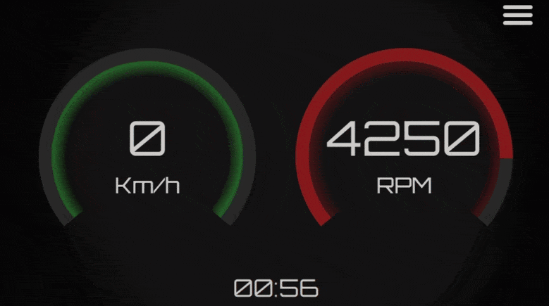

# CAR-BT-HMI

A Qt-based head‑up display application that connects to an ELM327 OBD‑II Bluetooth adapter to show real‑time vehicle data (speed, RPM, etc.) on a custom dashboard. Designed for Raspberry Pi with a 7‑inch display and Android devices, but also runs on desktop Linux and Windows.

## Table of Contents
- [Demo](#demo)
- [Features](#features)
- [Requirements](#requirements)
- [Installation](#installation)
- [Building](#building)
- [Running](#running)
- [Project Structure](#project-structure)
- [License](#license)

## Demo


## Features
- **Real-Time Dashboard**: Custom speedometer and tachometer gauges with digital readouts.
- **Bluetooth Connectivity**: Automatically scans for and connects to ELM327 OBD‑II adapters.
- **Cross-Platform**: Runs on Raspberry Pi, Android, desktop Linux, and Windows.
- **Expandable**: Modular C++/QML architecture for adding new gauges or data sources.
- **Configurable**: User-selectable devices and settings stored across sessions.

## Requirements

### Hardware
- Raspberry Pi, Android device, or any Linux-compatible system with Bluetooth
- ELM327 OBD‑II Bluetooth adapter
- (Optional) 7‑inch touchscreen display for Raspberry Pi or Android

### Software
- Qt 6.4+ with Quick, Bluetooth, and Svg modules
- CMake 3.16+
- (For Android builds) Android SDK/NDK and Java development tools

## Installation
```bash
git clone https://github.com/lankow/CAR-BT-HMI.git
cd CAR-BT-HMI
```

## Building

### Desktop (Linux/Windows/Raspberry Pi)
Configure the build:
```bash
cmake -B build -S .
```

Compile:
```bash
cmake --build build
```

### Android
Use the Gradle wrapper in the android/ directory:
```bash
cd android
./gradlew assembleDebug    # or assembleRelease
```
The resulting APK will be located in `android/app/build/outputs/apk/`.

## Running

### Desktop
After a successful build:
```bash
./build/appcar-bt-hmi
```
Ensure Bluetooth is enabled, then follow the on-screen menu to pair with an ELM327 device and start displaying vehicle data.

### Android
Install the generated APK on your device and launch the app. Enable Bluetooth and select your ELM327 adapter from the in-app device list to begin streaming data.

## Project Structure
```
.
├─ android/     # Android packaging (Gradle project)
├─ demo/        # Demo assets (e.g., GIFs)
├─ fonts/       # Custom fonts (Orbitron)
├─ include/     # C++ headers (BluetoothManager, DataProvider, etc.)
├─ qml/         # QML interface components
├─ resources/   # SVGs and additional assets
├─ src/         # C++ implementations
└─ main.cpp     # Application entry point
```

## License
This project currently has no explicit license. If you plan to publish or distribute it, consider adding an open-source license file (e.g., MIT, Apache 2.0) in the repository root.
